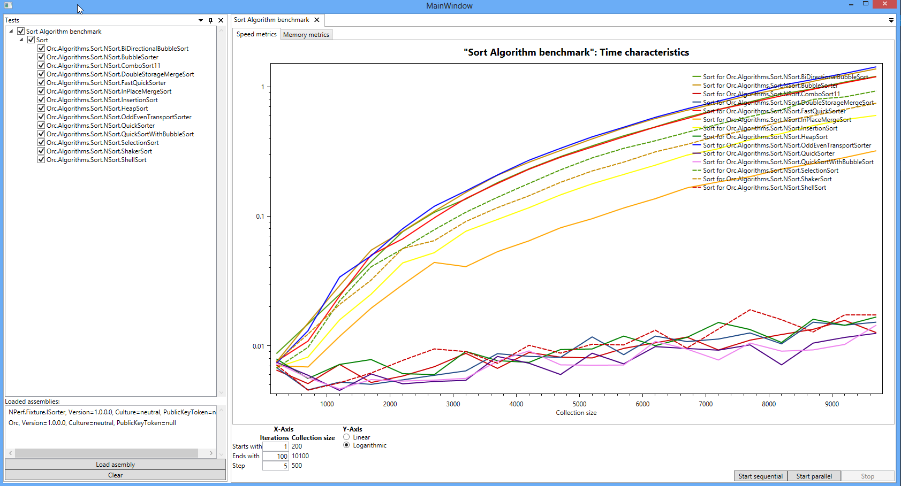

NPerfRunner
===========

NPerf Runner is a performance and memory benchmark runner for [NPerfProject][NPerf framework].

Original documentation: http://www.codeproject.com/Articles/5945/NPerf-A-Performance-Benchmark-Framework-for-NET

(Please note NPerf has been completly re-written, however it should be fully backwards compatible with the original Nperf.)

Introduction
=============

NPerf and NPerfRunner allow you to run performance tests against existing assemblies without having to change a line of code on the target assemblies.

If the methods you want to performance test implements an interface, you can write a performance fixture for that interface.
Once you have a compiled fixture you can load it into NPerfRunner as well as the assemblies you want to performance test. NPerfRunner accepts multiple target assemblies.

NPerfRunner will find all the classes in all the target assemblies that implement the desired interface and run the tests against them.
The performance results (time and memory) will be dynamically displayed on the chart.

The collection size as well as the chart axis scale (logarithmic or linear) can easily be changed.

For examples on how to write performance fixtures please have a look here: https://github.com/Orcomp/Orcomp

Setup
=====


- https://github.com/Orcomp/NPerf
- https://github.com/Orcomp/NPerfRunner


First open the Nperf project and build it.
Then open the NPerfRunner and set the start up project to "NPerfRunner.Wpf"

Step 0: Requirements
--------------------
+ Visual Studio 2012 with NuGet package manager.

Step 1: Download NPerf and NPerfRunner solutions from GitHub.
-------------------------------------------------------------
You will need these repositories:
https://github.com/Orcomp/NPerf
https://github.com/Orcomp/NPerfRunner
So download or Git clone them to the same local folder.

Step 2: Place both solutions in the same folder.
------------------------------------------------
If your base folder is "PerformanceTest”, then the structure must be like this:
[…]/PerformanceTest/NPerf/src/
[…]/PerformanceTest/NPerfRunner/docs/
[…]/PerformanceTest/NPerfRunner/src/
It’s important to name “NPerf” the folder because NPerfRunner solution imports libraries from it.
Otherwise, when you try to build NPerfRunner, it is going to fail because it can’t find required libraries.

Step 3: Open NPerf solution with Visual Studio and build it.
------------------------------------------------------------
Open /PerformanceTest/NPerf/src/Nperf.sln.
There may be some errors because Visual Studio can’t load missing packages.
If so, go to TOOLS > Options... > Package Manager > General and check “Allow NuGet to download missing packages during build”. Then rebuild the solution.

Step 4: Open NPerfRunner solution with Visual Studio and build it.
------------------------------------------------------------------
Open /PerformanceTest/NPerfRunner/src/NPerfRunner.sln
Set “NPerfRunner.Wpf” as StartUp project.
Build the solution and click “Start” to run the WPF application.

Step 5: Load the assemblies (dll’s) with the NPerf tests and start the tests.
-----------------------------------------------------------------------------
On the NPerfRunner WPF application window click “Load assembly...” and browse for the assembly with the tests. For example, to load the sample test ISorter do this:
* Unblock the file /PerformanceTest/NPerfRunner/docs/sample/NPerf.Fixture.ISorter.zip by right-­clicking onto it, then open “Properties”, and then click on “Unblock” at the bottom of the “General” tab.
* Unzip /PerformanceTest/NPerfRunner/docs/sample/NPerf.Fixture.ISorter.zip in the same folder.
* Then load the assemblies /PerformanceTest/NPerfRunner/docs/sample/NPerf.Fixture.ISorter/Orc.dll and /PerformanceTest/NPerfRunner/docs/sample/NPerf.Fixture.ISorter/NPerf.Fixture.ISorter.
dll
* If everything loaded correctly, click on “Start sequential” and you’ll get the graph.

How it works
============

NPerf.Fixture.ISorter example
-----------------------------

Load the performance fixture assembly as well as the assemblies you want to run the perfomance tests against.
(There are some sample assemblies in the "doc/sample" folder. "unblock" the zip file before extracting it.)

The sample zip file contains:
A test fixture - NPerf.Fixture.ISorter.dll
A target assembly - orc.dll

Run the NPerfRunner.wpf project.

Click on the "Load Assemblies" button. Select the two assemblies mentioned above. Then click on one of the "Start" buttons.

You should get a picture like this:



The chart uses the Oxyplot library (http://oxyplot.codeplex.com/) so you can zoom, pan, click on a line to see tooltips etc... (Please refere to the oxyplot homepage for shortcut keys.)

NPerf.Fixture.IList example
---------------------------

This sample test fixture compares the performance of several System.Collections.Generic.IList<T> implementations from two libraries:
+ **.NET Base Class Library (BCL)**: Located in the assembly mscorlib.dll.
++ http://msdn.microsoft.com/en-us/library/gg145045.aspx
+ **C5 Library**: There's a copy into NPerfRunner/src/libs folder for testing.
++ Homepage: http://www.itu.dk/research/c5/
++ GitHub repository: https://github.com/sestoft/C5/

Into NPerfRunner solution there is a project called NPerf.Fixture.IList which contains these performance tests.
Into this project there is a class called IListPerfs that has the test fixtures.

```C#
[PerfSetUp]
public void SetUp(int testIndex, IList<int> list)
{
    this.count = this.CollectionCount(testIndex);

    for (var i = 0; i < this.count; i++)
    {
        list.Add(i);
    }
}
```

Troubleshooting
===============

Visual Studio cannot find package Microsoft.Bcl.Build.1.0.8.
------------------------------------------------------------
+ Enable NuGet package restore. 
+ Run nuget install NPerfRunner/packages.config


<!-- LINKED REFERENCES -->
[NPerfProject]: https://github.com/Orcomp/NPerf